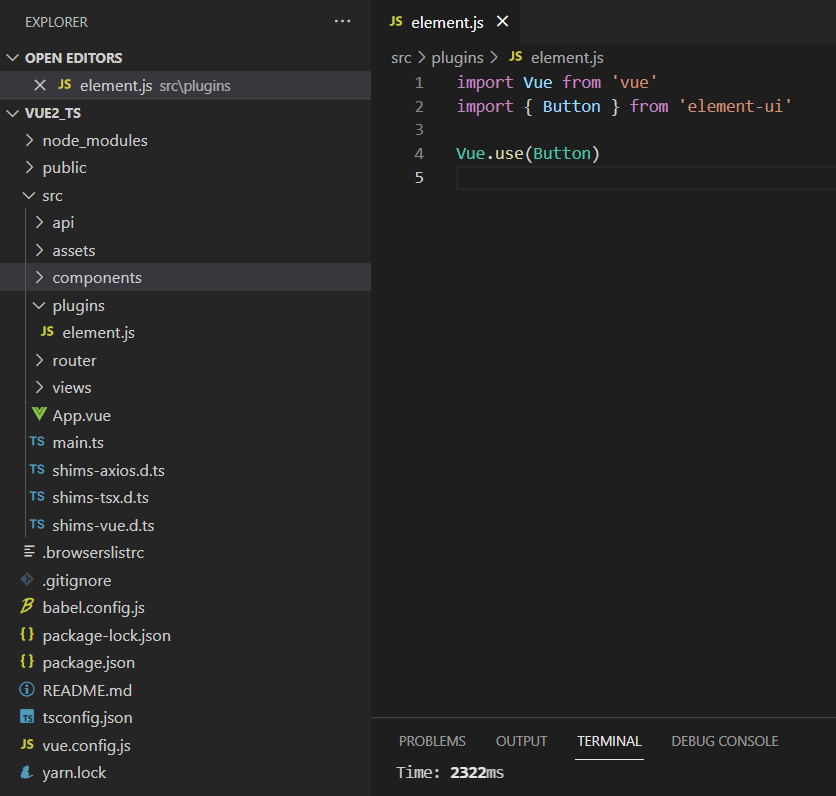
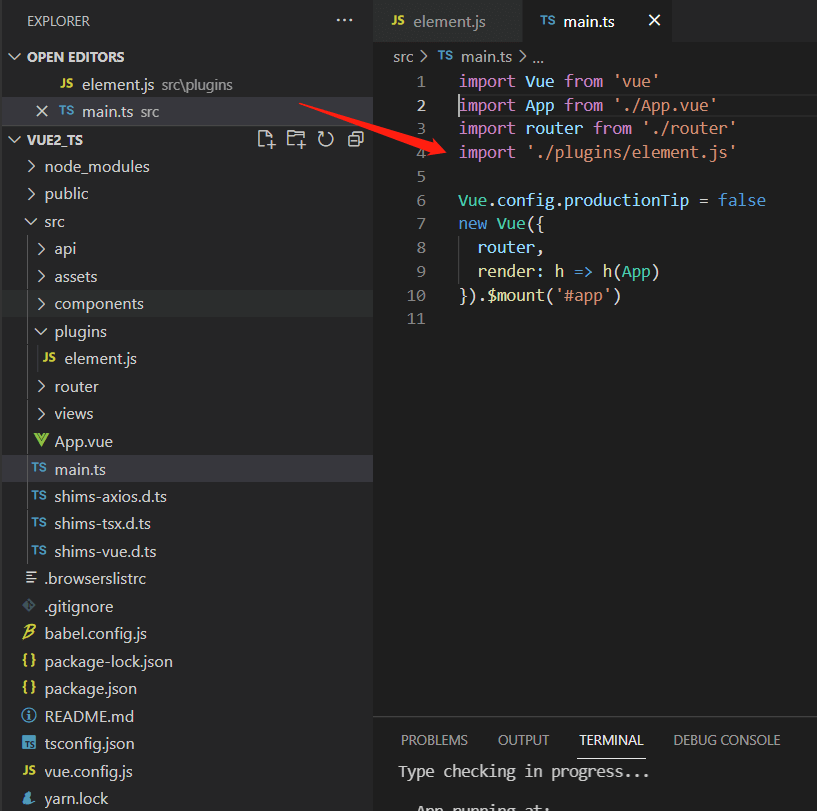

# Vue2项目typescript实战
## 预热知识
1. tsconfig.json文件
```js
{
  "compilerOptions": {
    "target": "esnext",/* target用于指定编译之后的版本目标: 'ES3' (default), 'ES5', 'ES2015', 'ES2016', 'ES2017', 'ES2018', 'ES2019' or 'ESNEXT'. */
    "module": "esnext",/* 用来指定要使用的模块标准: 'none', 'commonjs', 'amd', 'system', 'umd', 'es2015', or 'ESNext'. */
    "strict": true,/* strict的值为true或false，用于指定是否启动所有类型检查，如果设为true则会同时开启下面这几个严格类型检查，默认为false */
    "jsx": "preserve",/* 指定jsx代码用于的开发环境: 'preserve', 'react-native', or 'react'. */
    "importHelpers": true,/* importHelpers的值为true或false，指定是否引入tslib里的辅助工具函数，默认为false */
    "moduleResolution": "node",/* 用于选择模块解析策略，有'node'和'classic'两种类型' */
    "experimentalDecorators": true,/* 用于指定是否启用实验性的装饰器特性 */
    "skipLibCheck": true,
    "esModuleInterop": true,/* 通过为导入内容创建命名空间，实现CommonJS和ES模块之间的互操作性 */
    "allowSyntheticDefaultImports": true,/* 用来指定允许从没有默认导出的模块中默认导入 */
    "sourceMap": true, /* sourceMap的值为true或false，用来指定编译时是否生成.map文件 */
    "baseUrl": ".",/* baseUrl用于设置解析非相对模块名称的基本目录，相对模块不会受baseUrl的影响 */
    "types": [/* types用来指定需要包含的模块，只有在这里列出的模块的声明文件才会被加载进来 */
      "webpack-env"
    ],
    "paths": { /* 用于设置模块名称到基于baseUrl的路径映射 */
      "@/*": [
        "src/*"
      ]
    },
    "lib": [/* lib用于指定要包含在编译中的库文件 */
      "esnext",
      "dom",
      "dom.iterable",
      "scripthost"
    ]
  },
  "include": [ //include也可以指定要编译的路径列表，但是和files的区别在于，这里的路径可以是文件夹，也可以是文件，可以使用相对和绝对路径，而且可以使用通配符，比如"./src"即表示要编译src文件夹下的所有文件以及子文件夹的文件
    "src/**/*.ts",
    "src/**/*.tsx",
    "src/**/*.vue",
    "tests/**/*.ts",
    "tests/**/*.tsx"
  ],
  "exclude": [// exclude表示要排除的、不编译的文件，它也可以指定一个列表，规则和include一样，可以是文件或文件夹，可以是相对路径或绝对路径，可以使用通配符
    "node_modules"
  ]
}
```
2. vue-property-decorator 与 vue-class-component 有什么区别？
```js
vue-class-component 是vue 官方出的
强化 Vue 组件，使用 TypeScript/装饰器 增强 Vue 组件；
vue-property-decorator 是社区出的
其中vue-class-component 提供了 vue component 等等
vue-property-decorator 深度依赖了 vue-class-component 
拓展出了很多操作符 @Prop @Emit @Inject 等等 
可以说是 vue-class-component 的一个超集
正常开发的时候 你只需要使用 vue-property-decorator 中提供的操作符即可 
不用再从vue-class-componen 引入vue component
```
3. vue 文件中 TS 上下文顺序
```js
- data
- @Prop
- @State
- @Getter
- @Action
- @Mutation
- @Watch
- 生命周期钩子
    - beforeCreate（按照生命周期钩子从上到下）
    - created
    - beforeMount
    - mounted
    - beforeUpdate
    - updated
    - activated
    - deactivated
    - beforeDestroy
    - destroyed
    - errorCaptured（最后一个生命周期钩子）
- 路由钩子
    - beforeRouteEnter
    - beforeRouteUpdate
    - beforeRouteLeave
- computed
- methods
- 组件引用，mixins，filters 等放在 @Component 里面
```
4. 工程目录结构(供参考)
```js
src：项目源码。开发的时候代码写在这里。
 |--api # 服务层ajax请求服务
 |    |--index # api数据入口文件
 |--assets # 项目静态资源
 |--axios # axios封装请求//拦截配置
 |    |--config.ts # axios拦截器配置文件
 |    |--service.ts # axios请求配置文件
 |--components # 项目公共组件库
 |--router # 项目路由
 |    |--index.ts # 入口及路由初始化
 |    |--filterRouter # 页面路由文件
 |--store # 基于Vuex的状态管理模块
 |    |--index.ts # 入口及store初始化
 |    |--modules # 子模块的store对象
 |--utils # 公共库函数
 |--views # 项目应用页面，根据应用需要，还可以有子页面，各子页面目录结构和顶级子页面类似
 |--App.vue # 项目根视图
 |--main.ts # 项目入口文件

```
5. ts中使用elementui插件，这个使用方法和普通项目引入方法一样，
如果是按需引入的方式。如图：


